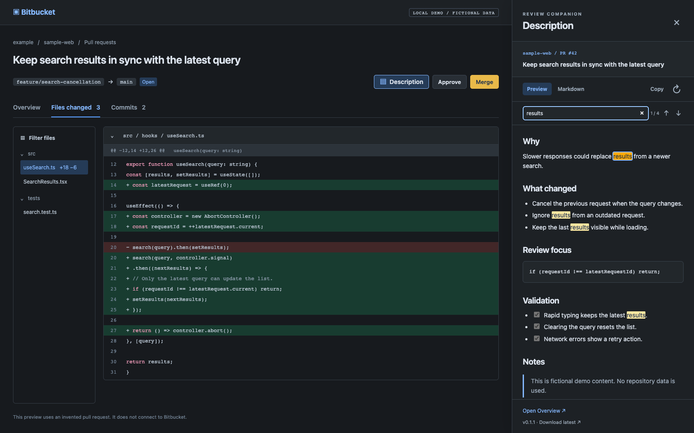

# Bitbucket PR Description

**Bitbucket에서 코드와 PR 설명을 나란히 읽는 Chrome 확장프로그램입니다.**

코드를 리뷰하면서 변경 이유나 확인 항목을 다시 읽으려면 **Files changed**와 **Overview** 탭을 오가야 합니다. 이 번거로움을 줄이기 위해, **Approve 옆의 Description 버튼**으로 PR 설명을 오른쪽 패널에 열 수 있게 만들었습니다.



미리보기는 가상의 저장소와 PR로 구성했습니다.

## 주요 기능

- 코드 옆에서 PR 제목과 설명을 함께 확인합니다.
- **Preview / Markdown**으로 읽기 화면과 원문을 전환합니다.
- 설명 안에서 검색하고, 이전·다음 결과로 이동합니다.
- **Copy** 버튼으로 Markdown 원문을 복사합니다.
- 패널 너비를 조절하고, **↻** 버튼으로 수정된 설명을 다시 불러옵니다.
- **Esc** 또는 **×** 버튼으로 닫으며, 밝은·어두운 테마를 지원합니다.

## 설치

1. [최신 버전 설치용 ZIP](https://github.com/wondonghwi/bitbucket-pr-description/releases/latest/download/bitbucket-pr-description.zip)을 다운로드합니다.
2. ZIP의 압축을 풀고, 계속 사용할 폴더에 보관합니다. 설치 후에도 이 폴더가 필요합니다.
3. Chrome 주소창에 `chrome://extensions`를 입력합니다.
4. 오른쪽 위의 **개발자 모드**를 켭니다.
5. **압축해제된 확장 프로그램을 로드합니다**를 누르고 **`manifest.json`이 들어 있는 폴더**를 선택합니다.

Chrome Web Store에는 등록되어 있지 않습니다. Release의 **Source code (zip)** 대신 위의 설치용 ZIP을 사용하세요.

## 사용법

1. Bitbucket PR의 **Files changed** 탭을 열고 페이지를 새로고침합니다.
2. **Approve 옆의 Description** 버튼을 누릅니다.
3. 오른쪽의 설명을 참고하면서 코드를 리뷰합니다.
4. 넓은 화면에서는 패널의 왼쪽 경계를 드래그해 너비를 조절합니다.
5. 설명이 수정되었으면 **↻**를 누르고, 패널을 닫으려면 **Esc** 또는 **×**를 누릅니다.

**Find in description**에 검색어를 입력합니다. **↑ / ↓**, **Enter / Shift+Enter**로 결과를 이동하고, **Copy**로 Markdown 원문을 복사합니다.

**Open Overview**는 현재 PR의 Overview를 새 탭에서 엽니다. 설명을 불러오지 못하거나 이미지를 확인하고 싶을 때 사용할 수 있습니다.

## 새 버전으로 업데이트하기

패널 아래에서 현재 버전과 **Download latest** 링크를 확인할 수 있습니다.

1. [최신 설치용 ZIP](https://github.com/wondonghwi/bitbucket-pr-description/releases/latest/download/bitbucket-pr-description.zip)을 받습니다.
2. 기존에 설치한 폴더의 파일을 새 ZIP의 파일로 교체합니다. 폴더 경로는 유지합니다.
3. `chrome://extensions`에서 확장프로그램 카드의 **새로고침 버튼**을 누릅니다.
4. Bitbucket PR 페이지를 새로고침합니다.

다운로드 가능한 버전은 자동으로 발행되지만, 이 설치 방식에서는 Chrome이 새 버전을 자동으로 설치하지 않습니다.

## 직접 수정하면서 사용하기

Node.js 24.15 이상과 pnpm 10.33.0을 사용합니다.

```bash
git clone https://github.com/wondonghwi/bitbucket-pr-description.git
cd bitbucket-pr-description
pnpm install --frozen-lockfile
pnpm build
```

`chrome://extensions`에서 **압축해제된 확장 프로그램을 로드합니다**로 프로젝트의 **`dist` 폴더**를 선택합니다.

수정한 내용을 반영하는 순서는 다음과 같습니다.

1. `src` 안의 소스를 수정합니다. `dist`는 빌드 결과이므로 직접 수정하지 않습니다.
2. 프로젝트 폴더에서 `pnpm build`를 실행합니다.
3. `chrome://extensions`에서 확장프로그램 카드의 **새로고침 버튼**을 누릅니다.
4. Bitbucket PR 페이지를 새로고침합니다.

```bash
pnpm check    # 포맷·테스트·빌드 확인
pnpm demo     # 가상 PR 미리보기: http://127.0.0.1:4173
pnpm package  # 설치용 ZIP 생성
```

기능·빌드·테스트 코드를 `main`에 push하면 GitHub Actions가 패치 버전을 올리고, 검증을 통과한 설치용 ZIP을 [Releases](https://github.com/wondonghwi/bitbucket-pr-description/releases)에 발행합니다. 예를 들어 `0.1.1 → 0.1.2`로 올라가며, README나 미리보기만 수정하면 버전을 올리지 않습니다. 버전 파일이나 태그를 직접 수정할 필요가 없습니다.

릴리스가 실패하면 [Actions의 Release 실행](https://github.com/wondonghwi/bitbucket-pr-description/actions/workflows/release.yml)에서 재실행할 수 있습니다. 이미 만든 태그가 있으면 같은 버전의 배포를 이어갑니다.

## 지원 범위

Chrome 109 이상과 **Bitbucket Cloud(`bitbucket.org`)**의 PR 상세 페이지를 대상으로 합니다. 해당 PR에 접근할 수 있는 로그인 세션이 필요하며, Bitbucket Server / Data Center는 지원하지 않습니다.

가상 PR과 자동 테스트로 검증했으며, 실제 로그인된 PR의 조회와 최신 Bitbucket 화면의 배치는 아직 검증하지 않았습니다. Bitbucket의 웹 세션용 읽기 경로를 사용하므로 사이트 변경에 따라 조회가 실패할 수 있습니다. 좁은 화면에서는 패널이 코드 위에 겹쳐 표시됩니다.
