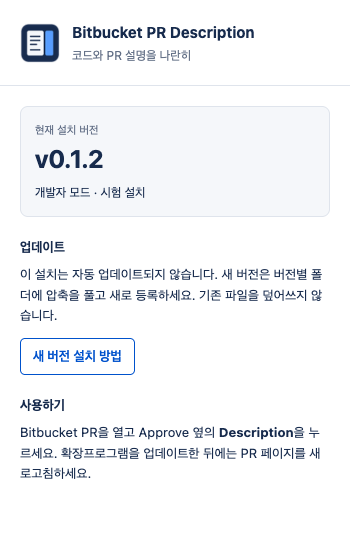

# Bitbucket PR Description

**Bitbucket에서 코드와 PR 설명을 나란히 읽는 무료 오픈소스 Chrome 확장프로그램입니다.**

코드를 리뷰하면서 변경 이유나 확인 항목을 다시 읽으려면 **Files changed**와 **Overview** 탭을 오가야 합니다. 이 번거로움을 줄이기 위해, **Approve 옆의 Description 버튼**으로 PR 설명을 오른쪽 패널에 열 수 있게 만들었습니다.


미리보기는 가상의 저장소와 PR로 구성했습니다.

## 주요 기능

- 확장프로그램 아이콘에서 실제 설치 버전과 업데이트 방식을 확인합니다.
- 코드 옆에서 PR 제목과 설명을 함께 확인합니다.
- **Preview / Markdown**으로 읽기 화면과 원문을 전환합니다.
- 설명 안에서 검색하고, 이전·다음 결과로 이동합니다.
- **Copy** 버튼으로 Markdown 원문을 복사합니다.
- 패널 너비를 조절하고, **↻** 버튼으로 수정된 설명을 다시 불러옵니다.
- **Esc** 또는 **×** 버튼으로 닫으며, 밝은·어두운 테마를 지원합니다.

## 설치

현재는 설치용 ZIP으로 사용할 수 있습니다. [Releases](https://github.com/wondonghwi/bitbucket-pr-description/releases/latest)에서 **버전이 붙은 설치용 ZIP**을 선택하세요. `Source code (zip)`은 설치 파일이 아닙니다.

1. `bitbucket-pr-description-버전.zip`을 다운로드하고 압축을 풉니다.
2. 압축을 푼 폴더를 계속 사용할 위치에 보관합니다. 폴더 이름에 버전을 남겨두세요.
3. Chrome 주소창에 `chrome://extensions`를 입력하고 **개발자 모드**를 켭니다.
4. **압축해제된 확장 프로그램을 로드합니다**를 누르고 새 폴더의 **`manifest.json`이 들어 있는 위치**를 선택합니다.
5. Chrome 카드의 버전이 다운로드한 버전과 같은지 확인합니다.

Chrome 도구 모음의 확장프로그램 아이콘을 누르면 **현재 설치 버전과 업데이트 방식**을 확인할 수 있습니다. 필요하면 퍼즐 모양 메뉴에서 이 확장프로그램을 고정하세요.



## 사용법

1. Bitbucket PR의 **Files changed** 탭을 열고 페이지를 새로고침합니다.
2. **Approve 옆의 Description** 버튼을 누릅니다.
3. 오른쪽의 설명을 참고하면서 코드를 리뷰합니다.
4. 넓은 화면에서는 패널의 왼쪽 경계를 드래그해 너비를 조절합니다.
5. 설명이 수정되었으면 **↻**를 누르고, 패널을 닫으려면 **Esc** 또는 **×**를 누릅니다.

**Find in description**에 검색어를 입력합니다. **↑ / ↓**, **Enter / Shift+Enter**로 결과를 이동하고, **Copy**로 Markdown 원문을 복사합니다.

**Open Overview**는 현재 PR의 Overview를 새 탭에서 엽니다. 설명을 불러오지 못하거나 이미지를 확인하고 싶을 때 사용할 수 있습니다.

## 새 버전으로 업데이트하기

**시험 설치는 새 버전을 별도로 등록합니다. 기존 파일을 덮어쓰지 않습니다.**

1. [최신 Release](https://github.com/wondonghwi/bitbucket-pr-description/releases/latest)에서 버전이 붙은 ZIP을 받습니다.
2. 압축을 풀어 **새 버전 이름의 폴더**를 보관합니다.
3. `chrome://extensions`에서 기존 Bitbucket PR Description의 스위치를 **끔**으로 바꿉니다.
4. **압축해제된 확장 프로그램을 로드합니다**로 **새 버전 폴더**를 선택합니다.
5. 새 카드에 새 버전이 표시되는지 확인하고 Bitbucket PR 페이지를 새로고침합니다.

새 버전이 정상 동작하면 Chrome에서 이전 버전 카드를 삭제해도 됩니다. 두 버전을 동시에 켜지 마세요. 카드에 이전 버전이 표시되면 이전 폴더를 선택한 것입니다.

## 직접 수정하면서 사용하기

Node.js 24.15 이상과 pnpm 10.33.0을 사용합니다.

```bash
git clone https://github.com/wondonghwi/bitbucket-pr-description.git
cd bitbucket-pr-description
pnpm install --frozen-lockfile
pnpm build
```

`chrome://extensions`에서 **압축해제된 확장 프로그램을 로드합니다**로 프로젝트의 **`dist` 폴더**를 선택합니다.

수정한 내용을 반영하는 순서는 다음과 같습니다.

1. `src` 안의 소스를 수정합니다. `dist`는 빌드 결과이므로 직접 수정하지 않습니다.
2. 프로젝트 폴더에서 `pnpm build`를 실행합니다.
3. `chrome://extensions`에서 확장프로그램 카드의 **새로고침 버튼**을 누릅니다.
4. Bitbucket PR 페이지를 새로고침합니다.

```bash
pnpm check    # 포맷·테스트·빌드 확인
pnpm demo     # 가상 PR 미리보기: http://127.0.0.1:4173
pnpm package  # 설치용 ZIP 생성
```

## 지원 범위

Chrome 109 이상과 **Bitbucket Cloud(`bitbucket.org`)**의 PR 상세 페이지를 대상으로 합니다. 해당 PR에 접근할 수 있는 로그인 세션이 필요하며, Bitbucket Server / Data Center는 지원하지 않습니다.

가상 PR과 자동 테스트로 검증했으며, 실제 로그인된 PR의 조회와 최신 Bitbucket 화면의 배치는 아직 검증하지 않았습니다. Bitbucket의 웹 세션용 읽기 경로를 사용하므로 사이트 변경에 따라 조회가 실패할 수 있습니다. 좁은 화면에서는 패널이 코드 위에 겹쳐 표시됩니다.
